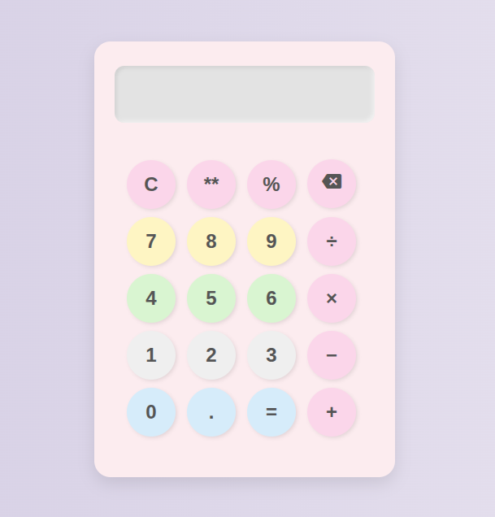

# Calculator

A simple web-based Calculator built as part of [The Odin Project](https://www.theodinproject.com/) curriculum. This project demonstrates fundamental JavaScript, HTML, and CSS skills by implementing a basic calculator that can perform standard arithmetic operations.

## Features

- Basic arithmetic operations: addition, subtraction, multiplication, division
- Responsive and accessible UI
- Keyboard and button support
- Clear and delete functions
- Error handling (e.g., division by zero)

## Screenshots



## Getting Started

### Clone the repository

```bash
git clone https://github.com/pikupika/Calculator.git
cd Calculator
```

### Open in Browser

Just open the `index.html` file in your preferred web browser:

```bash
# On most systems:
open index.html
# Or manually double-click the file in your file explorer
```

## How to Use

1. Enter numbers using the on-screen buttons or your keyboard.
2. Select the desired operation (`+`, `-`, `×`, `÷`).
3. Press `=` to see the result.
4. Use `C` or `Clear` to reset, and `DEL` or `Backspace` to delete the last input.

## Project Requirements

This project fulfills the following [Odin Project calculator assignment](https://www.theodinproject.com/lessons/foundations-calculator) requirements:
- Create functions for each arithmetic operation.
- Build a simple UI using HTML and CSS.
- Tie the UI to the logic with JavaScript.
- Handle edge cases and errors gracefully.

## Built With

- HTML5
- CSS3
- JavaScript (ES6+)

## Contributing

Pull requests are welcome! For major changes, please open an issue first to discuss what you would like to change.


> Project built as part of [The Odin Project](https://www.theodinproject.com/) curriculum.
